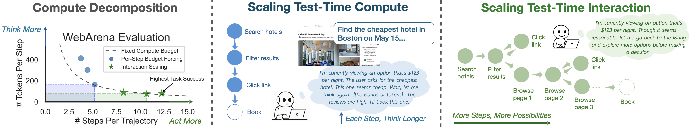

<h3 align="center">
Thinking vs. Doing:  Agents that Reason by  Scaling Test-Time Interaction
</h3>


<p align="center">
| <a href="https://test-time-interaction.github.io/"><b>Website</b></a> | <a href="https://arxiv.org/abs/"><b>Paper</b></a> | <a href="https://huggingface.co/sjunhongs/tti_webvoyager"><b>WebVoyager Model</b></a> | <a href="https://huggingface.co/sjunhongs/tti_webarena"><b>WebArena Model</b></a> |
</p>

---

Code repository for preprint "[Thinking vs. Doing:  Agents that Reason by  Scaling Test-Time Interaction]()".

[Junhong Shen*](https://sjunhongshen.github.io/), [Hao Bai*](https://jackgethome.com), [Lunjun Zhang](https://lunjunzhang.github.io/),  [Yifei Zhou](https://<username>02.github.io/), [Amrith Setlur](https://ars22.github.io/), [Shengbang Tong](https://tsb0601.github.io/), [Diego Caples](https://www.linkedin.com/in/diegocaples/), [Nan Jiang](https://nanjiang.cs.illinois.edu/), [Tong Zhang](https://tongzhang-ml.org/), [Ameet Talwalkar](https://www.cs.cmu.edu/~atalwalk/), [Aviral Kumar](https://aviralkumar2907.github.io/)<br>
CMU, Scribe, UIUC, U Toronto, UC Berkeley, The AGI Company, NYU
<br>
*Equal contribution

<p align="center">
    
</p>


## Overview

TTI (Test-Time Interaction) is a framework for improving agent reasoning through scaled interaction during test time. The codebase supports training and evaluation on WebArena and WebVoyager benchmarks using online reinforcement learning techniques (filtered behavioral cloning).

This code base supports:

- **Filtered Behavior Cloning**: Advanced imitation learning with trajectory filtering
- **Multi-GPU Support**: Distributed training with DeepSpeed
- **Vision-Language Models**: Support for multimodal agents with image understanding
- **Web Environment Integration**: Native support for WebArena and WebVoyager benchmarks


## Installation

### Prerequisites

- Python 3.10+
- CUDA-compatible GPU(s)
- Conda/Miniconda

### Environment Setup

1. **Clone the repository:**
   ```bash
   git clone https://github.com/test-time-interaction/TTI.git
   cd TTI
   ```

2. **Create and activate conda environment:**
   ```bash
   conda env create -f environment.yml
   conda activate tti
   ```

3. **Alternative pip installation:**
   ```bash
   pip install -e .
   ```

Before running training or evaluation, you need to set up the following credentials:

1. **OpenAI API Key** (required for some evaluations):
   ```bash
   export OPENAI_API_KEY='your_openai_api_key_here'
   ```

2. **Hugging Face Token** (required for model access):
   ```bash
   export HF_TOKEN='your_huggingface_token_here'
   ```

3. **Weights & Biases Key** (optional, for experiment tracking):
   - Update `wandb_key` in configuration files
   - Set `use_wandb: True` in configs to enable logging

### WebArena Setup

For WebArena experiments, you'll need to set up the WebArena containers following the [official instructions](https://github.com/web-arena-x/webarena/blob/main/environment_docker/README.md). To facilitate parallel data collection, we recommend creating multiple containers on a single machine. We provide a reference script to do so in `scripts/create_webarena_containers.sh`. Then, update the `webarena_host` addresses in the configuration files with your container endpoints.

## Usage

### Configuration Files

The main configuration files are located in `scripts/config/main/`:

- `webvoyager_rl.yaml` - WebVoyager training configuration
- `webvoyager_eval.yaml` - WebVoyager evaluation configuration
- `webarena_rl.yaml` - WebArena training configuration
- `webarena_eval.yaml` - WebArena evaluation configuration  
- `default.yaml` - Base configuration with common settings

Key parameters you may want to modify:
- `policy_lm`: The base language model to use
- `lm_lr`: Learning rate for the language model
- `batch_size`: Training batch size
- `rollout_size`: Number of trajectories to collect
- `vllm_tensor_parallel_size`: Number of GPUs for model parallelism
- `min_try`: Number of attempts the agent is allowed to submit an answer. For example, if it's set to 2, we are allowing the model to re-check its answer (this is the inference-time interaction scaling strategy mentioned in the paper, see [here]() for implementation)

We use at least 4x NVIDIA H100 GPU for both training and evaluation.

### Prompts

The configuration file specifies the agent and evaluation prompts, which are stored under the directory `prompts`. You can generate new prompts by 

### Data

Training data is stored in the `tasks/` directory:
- `webvoyager_train_data.jsonl` - WebVoyager training tasks
- `webvoyager_test_data.jsonl` - WebVoyager test tasks
- `webvoyager_subset.jsonl` - WebVoyager subset for real-time progress tracking
- `webarena_train_data.jsonl` - WebArena training tasks
- `webarena_test_data.jsonl` - WebArena test tasks  

### Training

Navigate to the scripts directory and run the appropriate training script:

```bash
cd scripts
```

#### WebVoyager Training  
```bash
./webvoyager_train.sh
```

#### WebArena Training
```bash
./webarena_train.sh
```

The training scripts will:
- Activate the conda environment
- Set required environment variables
- Alternate between data collection (using vllm) and model updates (using DeepSpeed)

In the training script, you can modify the curriculum learning schedule and the number of GPUs used.

### Evaluation

The TTI checkpoints of WebVoyager and WebArena are released:

- [TTI-WebVoyager](https://huggingface.co/sjunhongs/tti_webvoyager)
- [TTI-WebArena](https://huggingface.co/sjunhongs/tti_webarena)

You can directly specify these in the configuration file.


#### WebArena Evaluation
```bash
cd scripts
./webarena_eval.sh
```

#### WebVoyager Evaluation
```bash
cd scripts  
./webvoyager_eval.sh
```


## Troubleshooting

1. **CUDA out of memory**: Reduce `batch_size`, `safe_batch_size`, or `vllm_tensor_parallel_size`
2. **Port conflicts**: Change `master_port` values in training scripts
3. **WebArena connection errors**: Verify container setup and host addresses
4. **Model download failures**: Check HuggingFace token and internet connection

## Citation

If you use this code in your research, please cite:

```bibtex
@article{shenbai2025tti,
  title={},
  author={},
  year={2025}
}
```
